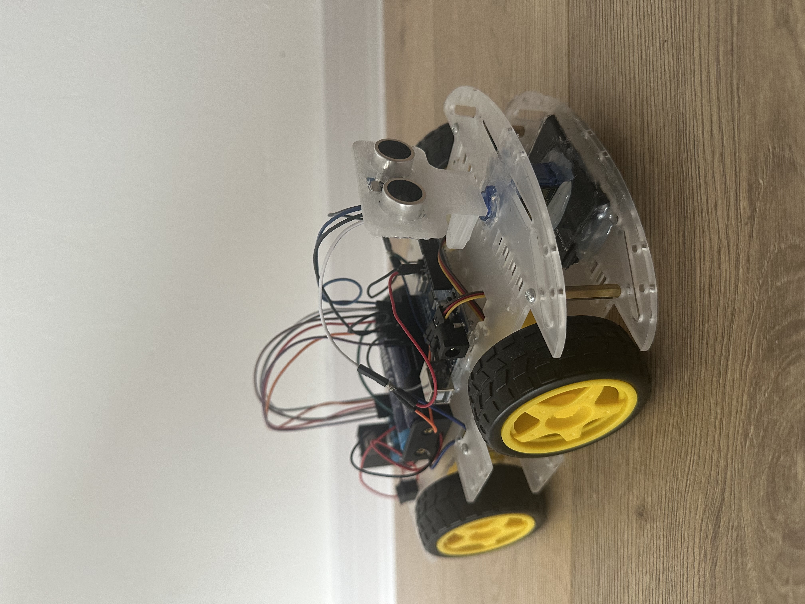
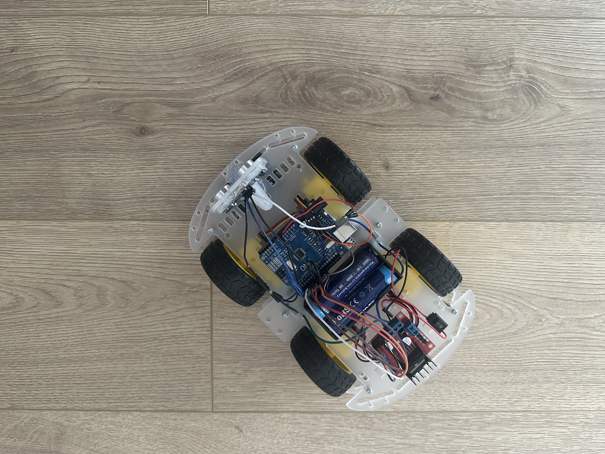

# Register Arduino Self-Driving Car

An autonomous mini-tank powered by Arduino (in native C++/AVR), designed to navigate and avoid obstacles using an ultrasonic radar and a servo mechanism with custom wiring.

---

## 📸 Project Overview

---

## 📂 Code Structure

The main logic relies on a modular approach to peripherals:
* `gpio.hpp` – Pin manipulation and handling
* `servo.hpp` – SG90 servo position control
* `hcsr04.hpp` – Distance measurement handling
* `l298n.hpp` – Motor control and movement direction

---

## 🛠️ Technical Specifications

| Component | Model / Type | Description |
| :--- | :--- | :--- |
| **Microcontroller** | Arduino UNO R3 (AVR) | The core system, code written natively in C/C++ using register-level libraries and `util/delay.h`. |
| **Motor Driver** | L298N | Controls DC motors and steps down voltage from the battery pack to provide regulated 5V logic power to Arduino. |
| **Distance Sensor** | HC-SR04 | An ultrasonic "radar" detecting obstacles ahead of the vehicle. |
| **Scanning Mechanism** | SG90 (Servo) | Rotates the HC-SR04 sensor left and right to scout for a clear path. |
| **Power Management** | XTAR 18650 (3.7V, 3300mAh, Li-ion Protected) x2 | Battery pack connected via a physical switch. |

---

## 📸 Bird's Eye View

---

## 🧠 How It Works

1. The tank moves straight forward (`L298N::forward()`).
2. In a continuous loop, it checks the distance ahead using the HC-SR04 sensor.
3. When an obstacle drops **below 15 cm**, the vehicle stops and triggers the `scan()` function:
   - Sweeps the servo to the left (0°) and measures distance. If clear, it turns left.
   - If blocked on the left as well, it sweeps the servo to the right (180°), measures, and turns right if clear.
   - If previous cases failed, motors turn 180° and scan again.
